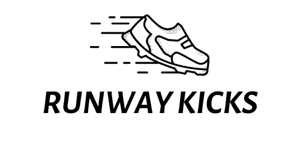

## ABOUT THE PROJECT
<h1> Runway Kicks </h1>
<div align="center"  width="100" height="100">
  
  <br>
  <br>
  <p>Welcome to Runway Kicks, a footwear ecommerce website for purchasing products. This website is designed to make it easy for you to browse and purchase a wide variety of shoes, from casual to formal, at competitive prices.</p>
  <br>
  <p>Our system provides a user-friendly platform that enables users to browse products, search, filter, add and place order with ease.. Additionally, all-encompassing administrative interface that enables authorized personnel to perform a wide range of operations, including Create, Read, Update, and Delete (CRUD) functions. </p>
</div>
<hr> 

## TECH STACKS USED

<p align = "center">


 

  
</p>
<hr>

## Features 
-  Authentication
-  API Validation
-  Responsive
-  Cross Platform
-  Registeration/Signin/Logout
-  Product Search 
-  Product Filter
-  Add to Cart
-  Order History Fetch
-  Admin can perform all CRUD operations

## Run Locally
### Clone this Project

```
https://github.com/Swati-Tanu/Runway-Kicks.git
```

### Install npm Packages

```javascript
npm i --global
```

### Go to Backend Folder
```javascript
cd backend
```

### Run Server
```javascript
npx nodemon index.js
```
### Runs the project in the development mode

[http://localhost:5000](http://localhost:5000)


### Environment Variables Required
`MongoURL`

`key`

`port`

## NPM Packages
<p align = "center">


     

</p>

## API Endpoints
   #### Welcome
```javascript
GET  /
```
  #### Registration
```javascript
POST  /user/register
```
  #### Signin
```javascript
POST  /user/login
```
#### Men Products 
```javascript
GET /men/
GET /men/filter
GET /men/exc
GET /men/sort
GET /men/search
POST  /men/create
PATCH /men/update/:id
DELETE /men/delete/:id
```
#### Women Products 
```javascript
GET /women/
GET /women/filter
GET /women/exc
GET /women/sort
GET /women/search
POST  /women/create
PATCH /women/update/:id
DELETE /women/delete/:id
```

#### Kids Products 
```javascript
GET /kid/
GET /kid/filter
GET /kid/exc
GET /kid/sort
GET /kid/search
POST  /kid/create
PATCH /kid/update/:id
DELETE /kid/delete/:id
```

#### Orders
```javascript
GET /order/
GET /order/search
```

#### Carts
```javascript
GET /cart/
POST  /cart/create
PATCH /cart/update/:id
DELETE /cart/delete/all
DELETE /cart/delete/:id
```

  #### Admin 
 ```javascript
 POST /admin/register
 POST /admin/login

 Credentials: 
 admin@gmail.com
 admin
 
 ```
    
   
<div align = "center">  
  
  
| `Project Highlights` |
| :------------------: | 

 <div align = "center">
   <h2>Landing Page</h2>
   
   <br>
   <h2>Product Page</h2>
    
   <h2>Sale Page</h2>
   
   <br>
   <h2>Community Page</h2>
   
   <br>
   <h2>Admin Dashboard</h2>
   
   <br>
<div/>
  <br>

| `Demo` |
| :----: | 
   

[FRONTEND](https://runwaykickswebsite.netlify.app/)

[BACKEND](https://hungry-hospital-gown-lamb.cyclic.app/)

 
| `Author` |
| :-------: | 
 
 [SWATI TANU](https://github.com/Swati-Tanu) 
 
