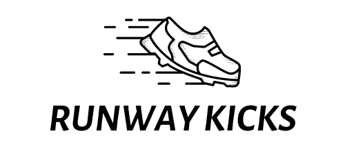

## ABOUT THE PROJECT

<h1> Runway Kicks </h1>
<div align="center"  width="100" height="100">
  
  <br>
  <br>
  <p>Welcome to Runway Kicks, a footwear e-commerce website for purchasing products. This website is designed to make it easy for you to browse and buy various shoes, from casual to formal, at competitive prices.</p>
  <br>
  <p>Our system provides a user-friendly platform that enables users to browse products, search, filter, add and place orders with ease. Additionally, an all-encompassing administrative interface that allows authorized personnel to perform a wide range of operations, including Create, Read, Update, and Delete (CRUD) functions. </p>
</div>
<hr>

## TECH STACKS USED

<p align = "center">


 

  
</p>
<hr>

## Features

- Authentication
- API Validation
- Responsive
- Cross Platform
- Registration/Signin/Logout
- Product Search
- Product Filter
- Add to Cart
- Order History Fetch
- Admin can perform all CRUD operations

## Run Locally

### Clone this Project

```
https://github.com/Swati-Tanu/Runway-Kicks.git
```

### Install npm Packages

```javascript
npm i --global
```

### Run Server

```javascript
npx nodemon index.js
```

### Runs the project in the development mode

[http://localhost:5000](http://localhost:5000)

### Environment Variables Required

`MongoURL`

`key`

`port`

## NPM Packages

<p align = "center">


     

</p>

| `Demo` |
| :----: |

[FRONTEND](https://runwaykickswebsite.netlify.app/)

[BACKEND](runway-kicks.onrender.com/api-docs/)

<div align = "center">  
  
  
| `Project Highlights` |
| :------------------: |

 <div align = "center">
   <h2>Landing Page</h2>
   

   <br>
   <h2>Product Page</h2>
    

   <br>
   <h2>Sale Page</h2>
   

   <br>
   <h2>Community Page</h2>
  

   <br>
   <h2>Admin Dashboard</h2>
   

   <br>
<div/>
  <br>

| `Author` |
| :------: |

[SWATI TANU](https://github.com/Swati-Tanu)
